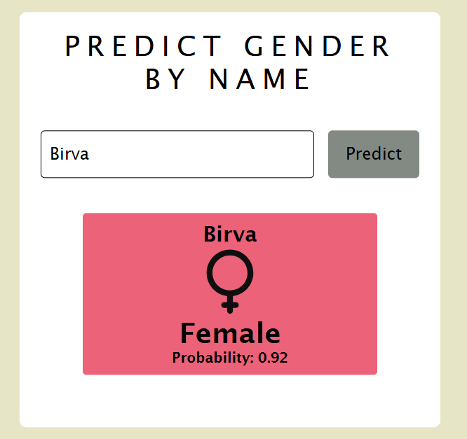

# Gender Predictor

## Description
The **Gender Predictor** app predicts the gender based on a given name using the [Genderize.io API](https://genderize.io/). The app validates the name, fetches the gender prediction, and displays the result with a gender icon.

### Features:
- Predicts gender from a name.
- Displays gender with an icon (male or female).
- Handles invalid input with error messages.

### Technologies:
- HTML, CSS, JavaScript
- Genderize.io API

## How to Run:
1. Clone the repository.
2. Open `index.html` in your browser.
3. Enter a name and click **Predict**.

## Screenshot:
